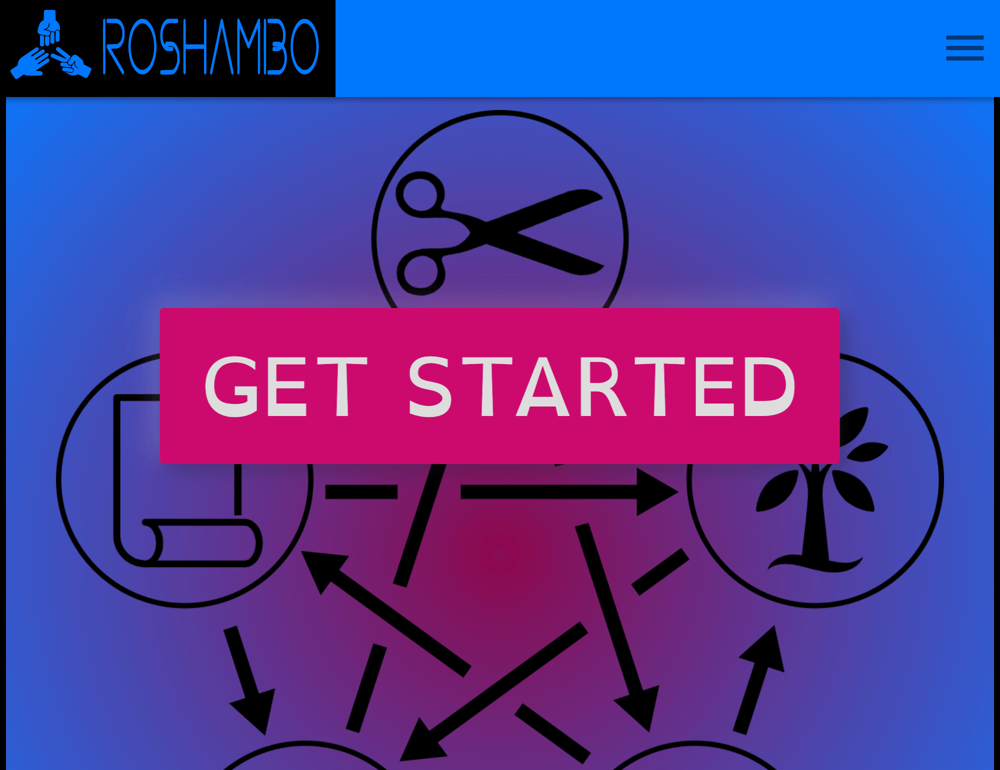
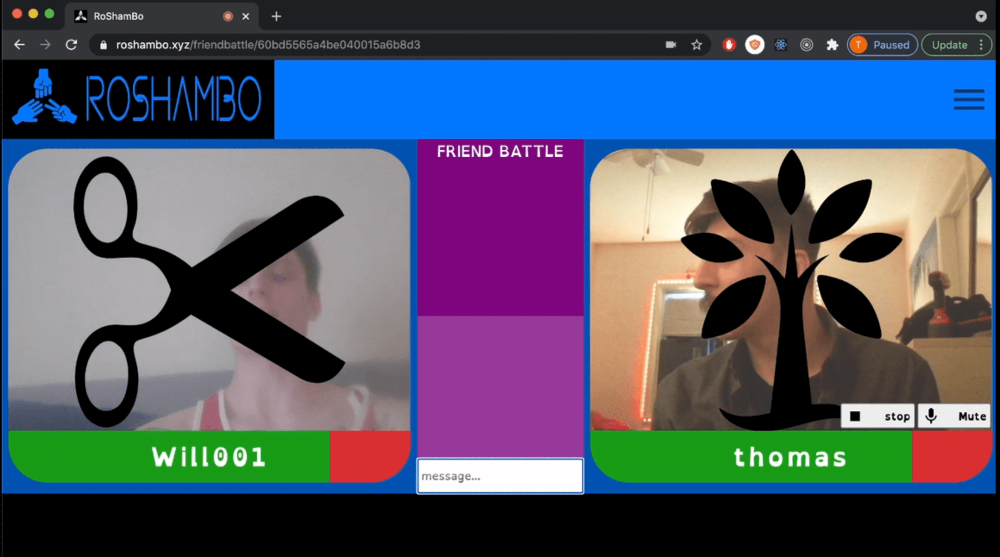

<h1 align='center'>RoShamBo TensorFlow</h1>
<h2 align='center'>Video-Chat Rock Paper Scissors</h2>

<a href='https://roshambo.xyz'>live now at roshambo.xyz</a>

<a href='https://roshambo.xyz'>

</a>

<h2 align='center'>Table of Contents</2>

<a href='#description'>Description</a>

<a href='#installation'>Installation</a>

<a href='#usage'>Usage</a>

<a href='#license'>License</a>

<a href='#questions'>Questions</a>

<h2>Description</h2>

Built in MERN stack with tensor-flow, WebRTC, socketIO, and Material UI. Users can battle a computer, friends, or random users in a rock paper scissors fight to the death, using their webcams and hand gestures to select weapons. The Fingerpose package, built on top of tensor-flow's <a href='https://github.com/tensorflow/tfjs-models/tree/master/handpose'>Handpose model</a>, is used to determine the user's hand gesture based on snapshots from their webcam stream. Authentication is JWT based and the front-end state management relies on React's context API.  

While researching tensor-flow I came across a crazy cool <a href='https://www.youtube.com/watch?v=WajtPtLAg-o'>video</a> / <a href='https://github.com/nicknochnack/CustomGestureRecognition'>demo</a> by Nicholas Renotte which detects hand poses and draws a canvas animation over the user's webcam. Inspired by Renotte's project, and using the same technique to detect gestures, I built some of my own handposes, and a social media/video-chat/websocket game based around using this as the player's controller.

This is just a game, and currently there are limitations to the handpose model (detects only one hand), but the possible future use of machine learning and hand gestures for user interface controls (and maybe even things like sign language detection) is extremely exciting.

<h2>Installation</h2>

Download the repo and run

    npm run install-all

Also needed is a .env file in the root directory with a MONGO_URI property set to a mongoDB connection string and SECRET property set to whatever you want your secret to be- any long, random string will do.

To run the project locally use the command

    npm run dev

This will start the server at <a href='http://localhost:8000'>localhost:8000</a>

And the user interface at <a href='http://localhost:3000'>localhost:3000</a>

<h2>Usage</h2>

Users can select weapons using their hand gesture once the game begins and a round has started

Once both players have selected their weapon choices and the data is sent to the server, the round outcome is sent back to the users and their health bars are updated, sound effects are triggered, and then the next round begins.

Rock beats scissors and bird. Paper beats rock and tree. Scissors beats paper and bird. Tree beats scissors and rock. Bird beats tree and paper.

<h2>License</h2>

</img>

<h2>Questions</h2>

Any questions on this or other projects can be directed to thomasjfoydel@gmail.com 

<h2>More Of My Projects</h2>

Thanks for checking this out! Find more of my work on <a href='https://github.com/thomasfoydel'>my GitHub</a>

